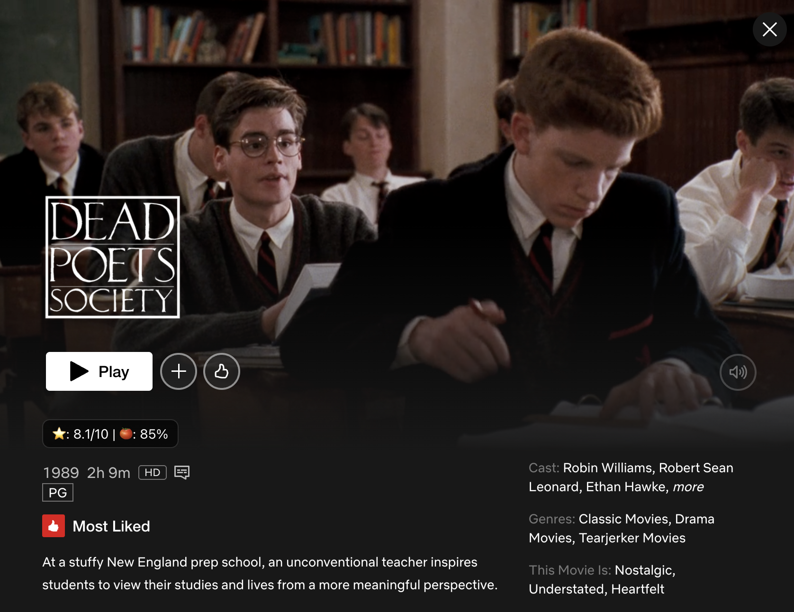
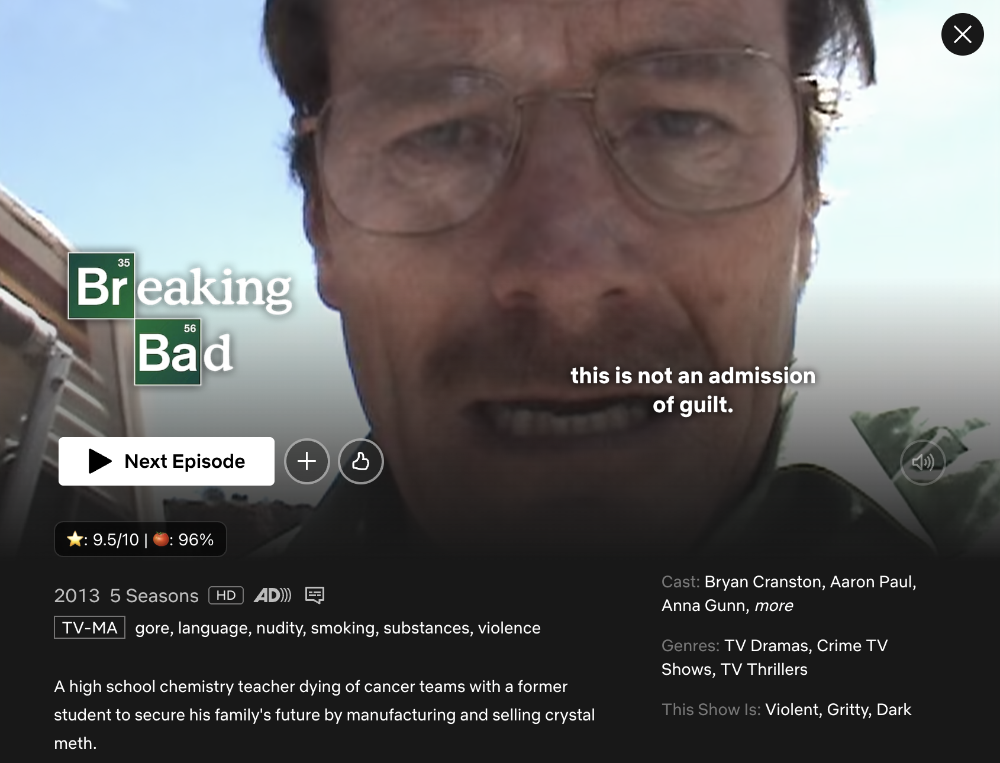
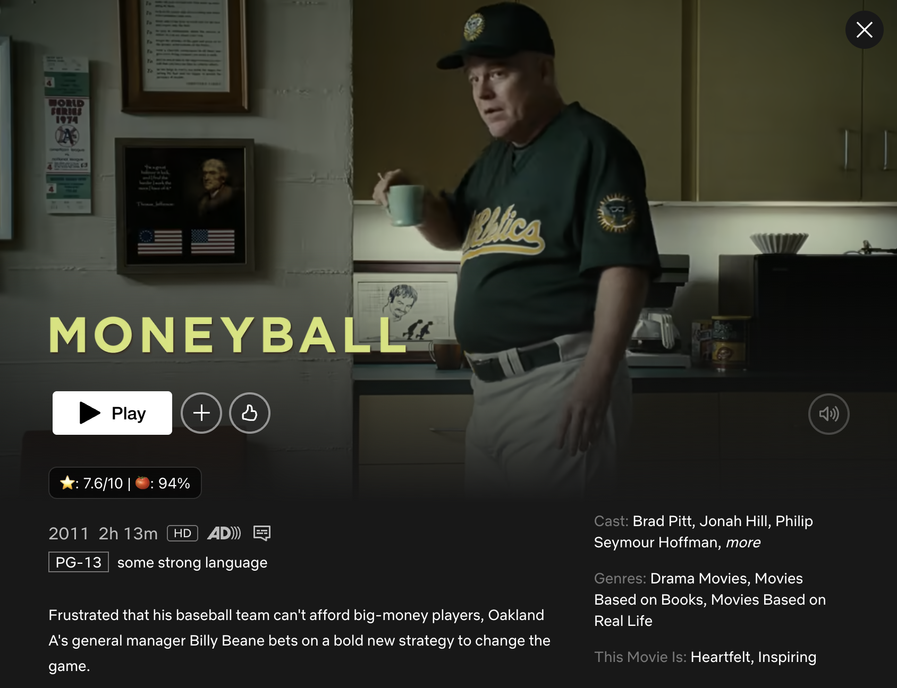

# Netflix Ratings Integration (IMDb & Rotten Tomatoes) 
A lightweight **Tampermonkey** userscript that shows **IMDb** and **Rotten Tomatoes** ratings on **Netflix** title pages (the preview modal / detail page that opens when you click a show or movie).

- 🚀 Works on `?jbv=...` Netflix title URLs and the “click-in” modal.
- 🔎 Uses stable metadata (JSON-LD / `og:title`) rather than scraping volatile UI.
- 🎯 Smart matching for ambiguous names (e.g., “The Perfect Neighbor”), using year + type and OMDb’s search fallback.
- ✨ Clean, unobtrusive badge injected under the **Play / Resume / Next Episode** row.
- 🔐 No tracking, no external libraries.

> **You must supply your own OMDb API key.** It’s free to get. See **Setup** below.

---

## Examples

<p align="center">
  <figure style="display:inline-block; text-align:center; margin: 0 10px;">
    <figcaption><b>Dead Poets Example</b></figcaption>
    
  </figure>
  <figure style="display:inline-block; text-align:center; margin: 0 10px;">
    <figcaption><b>Breaking Bad Example</b></figcaption>
    
  </figure>
  <figure style="display:inline-block; text-align:center; margin: 0 10px;">
    <figcaption><b>Moneyball Example</b></figcaption>
    
  </figure>
</p>

---

## Requirements

- **Chrome 138+** (or any Chromium-based browser with the new userscripts permission model)
- **Tampermonkey** v5.3+ (we tested on 5.4.0)
- **OMDb API key** (free) — https://www.omdbapi.com/apikey.aspx

> **Chrome 138+ permission change:** you must enable **Allow User Scripts** (or **Developer Mode**) for Tampermonkey, or userscripts will not run.

---

## Setup

1. **Install Tampermonkey**
   - Chrome Web Store → “Tampermonkey”.

2. **Enable userscripts (Chrome 138+)**
   - Go to `chrome://extensions/`
   - Click **Tampermonkey → Details**
   - Turn on **Allow User Scripts**  
     *(Developer Mode also works; “Allow User Scripts” is the cleanest)*
   - Confirm **Site access = On all sites**.

3. **Get your OMDb key**
   - Request a key at https://www.omdbapi.com/apikey.aspx
   - Open the email and **click the activation link**.
   - Test in the browser:  
     `https://www.omdbapi.com/?t=Breaking+Bad&apikey=YOUR_KEY` → should return JSON with `imdbRating`.

4. **Install the userscript**
   - Click the **Raw** button on [`src/netflix-ratings.user.js`](src/netflix-ratings.user.js) in this repo; Tampermonkey will prompt to install.
   - Open **Netflix**, click into any title (modal/detail).

5. **Add your API key**
   - In Tampermonkey Dashboard → click the script → set:
     ```js
     const OMDB_KEY = 'YOUR_KEY_HERE';
     ```
   - Save (⌘S / Ctrl+S) and refresh Netflix.

---

## How it works

- Detects the Netflix **title context** when `?jbv=` is present (that’s how Netflix identifies the open modal/page).
- Reads the **title/year/kind** from document metadata (JSON-LD → `og:title`) — avoids fragile UI scraping.
- Queries **OMDb**:
  1) Direct lookup with `t=`, `y=`, and `type=movie|series`  
  2) Fallback: `s=` (search) → pick the **best match** by normalized title + year + type → fetch by `i=imdbID`  
  3) Last resort: direct `t=` without constraints  
- Injects a small badge (⭐ for IMDb, 🍅 for RT) under the Play/Resume row.

---

## Configuration

Inside the script:

```js
// REQUIRED — your OMDb key
const OMDB_KEY = 'YOUR_OMDB_KEY';

// Optional: tweak where we mount the badge if Netflix changes their layout
function findActionRow() {
  return (
    document.querySelector('div.default-ltr-iqcdef-cache-vs9l2l.epdsfzu0') ||
    document.querySelector('div.billboard-links.button-layer.forward-leaning') ||
    document.querySelector('.previewModal--detailsContainer .button-layer') ||
    null
  );
} 
